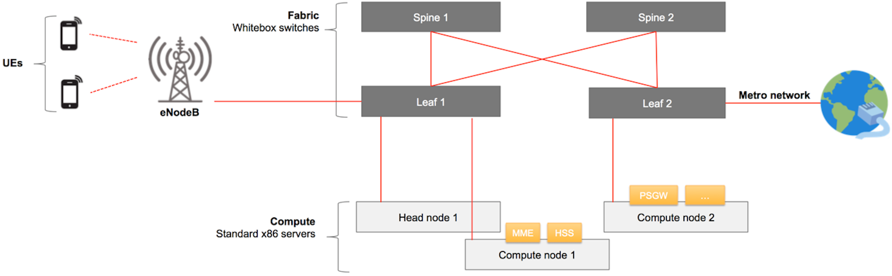
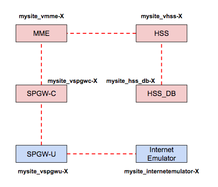

# Overview

## What is M-CORD

M-CORD is a CORD use-case for mobile edge cloud. The architecture allows
Service Providers to disaggregate both the RAN and the core, as well as to
virtualize their components, either as VNFs or as SDN applications. Moreover,
the architecture enables programmatic control of the RAN, as well as core
services chaining. M-CORD-based edge clouds are also capable of hosting MEC
services.

As for any other CORD flavor, the services management of both VNFs and SDN
applications is orchestrated by XOS.

M-CORD is a powerful platform that allows to rapidly innovate cellular
networks, towards 5G. As such, it features some 5G specific functionalities,
such as split-RAN (C-RAN), RAN user plane and control plane separation (xRAN),
programmable network slicing (ProgRAN), and MME-disaggregation. These features
have already been demonstrated.

The first release (4.1) of M-CORD ships with the basic CORD building blocks
(ONOS, XOS, Docker, and Open Stack), as well as with a number of VNFs to
support 3GPP LTE connectivity. These VNFs include a CUPS compliant open source
SPGW (in the form of two VNFs: SPGW-u and SPGW-c), as well as a VNF emulating
an MME with an integrated HSS, eNBs and UEs. The emulator is not open source.
It comes as a binary, courtesy of ng4T (<http://www.ng4t.com>), who provides
free trial licenses for limited use.

Following releases of M-CORD will complete the open source EPC suite, by
offering an MME, an HSS, as well as a PCRF VNF. The inclusion of these
additional VNFs is targeted for the 6.0 release.

The picture below shows a diagram representing a generic M-CORD POD.

As shown, M-CORD provides connectivity for wireless User Equipments (UEs) to
Packet Data Networks (PDNs). The PDNs are Service Provider specific networks,
such as VoLTE networks, and public networks, or such as the Internet.
Connectivity wise, at a high level M-CORD uses two networks: a Radio Access
Network (RAN) and a core (EPC in LTE and NG core in 5G) network. The RAN is
composed of a number of base stations (eNBs in LTE / gNBs in 5G) that provide
wireless connectivity to UEs while they move. eNBs are the M-CORD peripherals.
Both non-disaggregated and split eNBs architectures are supported. In case of a
split-RAN solution, the eNBs are split in two components: a Distributed Unit
(DU) and a Centralized Unit (CU). The CU is virtualized and implemented as a
VNF, exposed as a service (CUaaS) that can be onboarded, configured and
instantiated in XOS.

In the RAN, both the non-disaggregated eNB and the RU, are connected to the
M-CORD POD through a physical connection to one of the leaf switches. The
traffic generated by the UEs first travels wirelessly to the eNBs, which are
connected to the M-CORD fabric.

The 3GPP cellular connectivity requires a number of core network components.
The eNBs need to pass the UEs’ traffic to the SPGW-u VNF through the fabric and
the soft-switch, e.g. OVS, running on the server on which the VNF itself is
instantiated. 3GPP has its own control plane, which is responsible for mobility
and session management, authentication, QoS policy enforcement, billing,
charging, etc. For this reason, in addition to the SPGW-u, the eNB needs also
connectivity to the MME VNF to exchange 3GPP control messages. The 3GPP control
plane service graph also requires connectivity between the MME, the HSS, the
SPGW-c, the SPGW-u, and the PCRF VNFs. It’s the SPGW-u VNF that carries the UE
traffic out of the M-CORD POD through a leaf switch, towards an external PDN.

M-CORD is a powerful edge cloud solution: it allows Service Providers to push
all the core functionalities to the edge, while they distribute CORD across
their edge and central clouds, thereby extending core services across multiple
clouds.

## Glossary

> EXPERTS! Maybe we’re saying something obvious here, but we want to make sure
> we’ve a common understanding on the basic terminology, before going through
> the rest of the guide. If you already know all this, just skip this section.

Following is a list of basic terms used in M-CORD

* **Base Station**: a radio receiver/transmitter of a wireless communications
  station.
* **eNodeB** (Evolved Node B): the base station used in 4G/LTE network.
* **EPC** (Evolved Packet Core): it’s the core network of an LTE system. It
  allows user mobility, wireless data connections, routing, and authentication
* **HSS** (Home Subscriber Server): a central database that contains
  user-related and subscription-related information interacting with the MME.
* **MME** (Mobility Management Entity): it’s the key control node used in LTE
  access networks. An MME provides mobility management, session establishment,
  and authentication.
* **PCRF** (Policy and Charging Rules Function): a network function defined in
  the 4G/LTE standard. It computes in real-time the network resources to
  allocate for an end-user and the related charging policies.
* **RAN** (Radio Access Network): it describes a technology, a set of devices,
  to connect UEs to other parts of a network through radio connections
* **SP-GW-C** (Serving Gateway and PDN Gateway Control plane): a control plane
  node, responsible for signaling termination, IP address allocation,
  maintaining UE’s contexts, charging.
* **SP-GW-U** (Serving Gateway and PDN Gateway User plane): a user plane node
  connecting the EPC to the external IP networks and to non-3GPP services
* **UE** (User Equipment): any device used directly by an end-user to
  communicate to the base station, for example a cell phone.

## System Overview

The current release of M-CORD includes:

* An open source EPC, providing an SPGW control plane and an SPGW user plane
  (respectively represented in the system by two VMs deployed on the compute
  nodes). The current release of the EPC doesn’t yet provide MME, HSS and PCRF
  services.
* A closed source test suite, emulating UEs, eNodeBs, a minimal version of an
  MME with an integrated HSS, and an application server (used to emulate the
  upstream connectivity).

With customizations the system is able to use real hardware base stations, but
the released version supports just simple tests with emulated traffic.

At high level, a UE emulator generates some traffic, that passes through the
EPC, goes to an emulated application server, and then goes back to the traffic
generator again.

Looking at the system from another perspective, three VMs are provided (some of
which implement multiple services:

* **mysite_venb-X**: a test suite that emulates the RAN components (UEs,
  eNodeBs), an application server, and some of the EPC components (MME and HSS)
* **mysite_vspgwc-X**: a component of the EPC implementing the S-GW and the
  P-GW control plane functionalities
* **mysite_vspgwu-X**: a component of the EPC implementing the S-GW and the
  P-GW user plane functionalities

> NOTE: in the list above, X is a number that varies, and that is automatically
> generated by the system. More information on how to get the list of VMs can
> be found in the installation and troubleshooting guides, below.

The picture below describes how the VMs are connected.

Following, is a list of the networks between the VMs:

* **S11_net**: used to exchange control plane traffic between MME and SPGW
  (i.e. tunnel and IP address allocation)
* **S1U_net**: used to exchange user traffic. This specific network is used to
  exchange data between the RAN components (UEs, eNodeBs) and the EPC
* **SGI_net**: used to exchange user traffic. This specific network is used to
  exchange data between the EPC and the Application Server, running on the
  mysite_venb-X VM
* **spgw_net**: network dedicated to the communication of the vSPGW components
  (control plane and user plane)

User traffic is generated on the mysite_venb-X VM. It goes uplink via S1U_net,
reaches the EPC, flows through the SGI_net to the application server, emulating
Internet. The application server replies, and the answer flows back in
downlink, via SGI_net, through the EPC, via S1U_net, back to the emulated RAN
(eNB and UEs).

## Evolved Packet Core (EPC)

The EPC shipped with M-CORD is called “Next Generation Infrastructure Core”
(NGIC). It’s provided as an open source reference implementation by Intel. In
the current release it includes two services, implemented in separate VMs: the
vSPGW-C and the vSPGW-U.

The vSPGW-C and the vSPGW-U are the Control User Plane Separated (CUPS)
implementation of the conventional SAE-GW (S-GW and P-GW) which deals with
converged voice and data services on Long Term Evolution (LTE) networks. The
NGIC CUPS architecture is aligned with the 3GPP 5G direction. It has been
developed using data plane development kit (DPDK) version optimized for Intel
Architecture.

In this release 5.0, we also added MME, HSS, and HSS_DB as open source
reference implementations.

If you’re interested to know more and explore the EPC code, [see
here](https://gerrit.opencord.org/#/admin/projects/ngic).

## XOS Service Graph

XOS is CORD’s default orchestrator. It is described in detail in the XOS guide.
XOS lets service developers describe their services in high-level data models.
It then translates those models into configurations of system mechanisms, such
as VMs, containers, and overlay networks with the assistance of components such
as OpenStack and ONOS. Services can be linked together in the form of graphs.
In XOS, everything, including low-level system mechanisms, is implemented as a
service.

XOS comes with a UI for instantiating and onboarding services, and creating
service graphs. In the current implementation of M-CORD, the service graph
has the following representation in XOS:

Instances of services are connected to each other in the data plane via private
networks. On the orchestration side, they are connected via XOS-defined
relations called ServiceInstanceLinks. Using ServiceInstanceLinks, services can
query other services in a given instance of the service graph, for example to
discover each other’s configurations. Besides ServiceInstanceLinks, several
other constructs are involved in the construction of the service graph. These
are outlined below:

* **Services**: Services are representations of a deployed VNF software. There
  is only one instance of a service on a given pod. In M-CORD, there is a
  single service object each for NG40 vTester (vENBService), SPGWC
  (vSPGWCService) and SPGWU (vSPGWUService). These service objects are brought
  up by a TOSCA recipe when an MCORD pod is built.
* **ServiceInstances**: ServiceInstances are representations of deployed VNFs
  for a single subscriber or as is the case for M-CORD, a class of subscribers.
  ServiceInstances are created by another one of MCORD’s services,
  vEPC-as-a-service (described below).
* **Slices**: Slices are units of compute and network resource allocations. All
  VMs and Networks created by XOS are associated with slices.

## vEPC-as-a-Service

vEPC-as-a-Service is a special service that only operates in the service
control plane, and has no data-plane functionality. Its job is to bring up and
help configure instances of the service graph described in this document. The
implementation of vEPC-as-a-Service contains a declarative description of the
service graph in its config file,
<https://github.com/opencord/epc-service/blob/cord-5.0/xos/synchronizer/vepc_config.yaml>.
It is contained in an option called “blueprints”.

In the blueprint graph, the network section configures the networks, and the
graph section defines ServiceInstances and links them together via those
networks.

When a new ServiceInstance of vEPC-as-a-Service is created via the UI, the
entire service graph in this blueprint is instantiated and linked to that
vEPC-as-a-Service instance. The XOS linkages in the graph ensure that services
are instantiated in the correct order based on dependencies between them, while
services that have no dependencies are instantiated in parallel.

Note that vEPC-as-a-Service does not perform any operations that cannot be
invoked via the UI, via the REST API, or via the TOSCA engine. It creates data
model objects via XOS APIs, just as a user could do manually via the UI, REST,
or TOSCA. However, it conveniently performs all of the operations in a single
step, and in a valid order so that when an object is created, its dependencies
are guaranteed to be met.

## XOS Synchronizers

Once the objects in the XOS data model have been created, it is up to the XOS
synchronizers to translate them and make the service operational. Synchronizers
are controllers that run in their own containers and react to changes in the
data model to communicate those changes to the VNF in question. In the M-CORD
setup, there are synchronizers for each of the services: vENB, vMME, vHSS,
vHSS_DB, vSPGWU, vSPGWC, as well as vEPC-as-a-service. In addition, there are
also synchronizers for the back-end components: OpenStack and ONOS.

There are two parts of a synchronizer: `model policies` and `sync steps`. Model
Policies operate on the data model. vEPC-as-a-service is a good example of a
synchronizer that only contains model policies, as it does not have any
data-plane functionality. When a vEPC-as-a-service instance is created, it
simply creates the corresponding M-CORD service objects, links them together
and retreats, leaving it up to other service synchronizers, as well as ONOS and
OpenStack to instantiate VMs, configure them, and create networks and network
interfaces.

“Sync steps” operate on the rest of the system, with the data model excluded. A
sync step is typically linked to an Ansible playbook that configures a piece of
software. Aside from the playbook, it contains Python code that collects
configurations from the XOS data model, via its own data model, and those of
neighbouring services in the service graph, and having done so, translates it
into arguments for the playbook.

