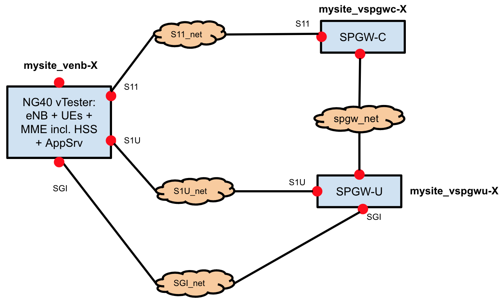

# Troubleshooting

Sometimes, components may not come up in a clean state. In this case, following paragraph may help you to debug, and fix the issues.

Most of the times, debug means do the procedure that the automated process would do, manually. Here are few manual configuration examples.

Before reading this paragraph, make sure you’ve already covered the general CORD troubleshooting guide, at in the main [troubleshooting section](../../troubleshooting.md).

The troubleshooting guide often mentions interfaces, IPs and networks. For reference, you can use the diagram below.



## See the status and the IP addresses of your VNFs

You may often need to check the status of your M-CORD VNFs, or access them to apply some extra configurations or to debug. To check the status or to know the IP of your VNF, do the following:

* SSH into the head node
* Type following commands:
```
source /opt/cord_profile/admin-openrc.sh
nova list --all-tenants
```

## View interface details for a specific VNF
* SSH into the head node
* List your VNF VMs, following the procedure at <troubleshooting.md#see-the-status-and-the-ip-addresses-of-your-vnfs>
* Find the ID of the specific instance (i.e. `92dff317-732f-4a6a-aa0d-56a225e9efae`)
* To get the interfaces details of the VNF, do
```
nova interface-list ID_YOU_FOUND_ABOVE
```

## How to log into a VNF VM
Sometimes, you may need to access a VNF (VM) running on one of the compute nodes. To access a VNF, do the following.
* SSH into the head node
* From the head node, SSH into the compute node running the VNF. Use the following commands:
```
ssh-agent bash
ssh-add
ssh -A ubuntu@COMPUTE_NODE_NAME
```

> Note: You can get your compute node name typing cord prov list on the head node

* SSH into the VM from compute node
```
ssh ubuntu@IP_OF_YOUR_VNF_VM
```

> Note: To know the IP of your VNF, refer to [this paragraph](troubleshooting.md#see-the-status-and-the-ip-addresses-of-your-vnfs). The IP you need is the one reported under the `management network`.

## View an interface name, inside a VNF

In the troubleshooting steps below you’ll be often asked to provide a specific VNF name. To do that, follow the steps below:
* From the head node, find the IP address of the VNF interface attached to a specific network. To do that, refer to the steps reported [here](troubleshooting.md#see-the-status-and-the-ip-addresses-of-your-vnfs).
* SSH into the VNF, following the steps [here](troubleshooting.md#how-to-log-into-a-vnf-vm).
* Run ifconfig inside the VNF. Look for the interface IP you discovered at the steps above. You should see listed on the side the interface name.

## Understand the M-CORD Synchronizers logs

As the word says, synchronizers are XOS components responsible to synchronize the VNFs status with the configuration input by the Operator. More informations about what synchronizers are and how they work, can be found [here](../../xos/dev/synchronizers.md>.

In case of issues, users may need to check the XOS synchronizers logs. Synchronizers are no more than Docker containers running on the head node. Users can access their logs simply using standard Docker commands:

* SSH into the head node
* Type the following
```
docker logs -f NAME_OF_THE_SYNCHRONIZER
```

> Note: to list the containers running on the head node (including the ones operating as synchronizers), use the command `docker ps`.

It may happen that some error messages appear in the logs of your M-CORD VNF synchronizers.

Following, is a list of the most common cases.

* **Case 1**: “Exception: defer object `<something>_instance<#>` due to waiting on instance”
It means a VNF cannot come up correctly.
To check the overall instances status, follow the procedure described [here](troubleshooting.md#see-the-status-and-the-ip-addresses-of-your-vnfs). If your instances are in any status other than `ACTIVE` or `BUILD` there’s an issue. This might happen simply because something temporarily failed during the provisioning process (so you should try to rebuild your VNFs again, following [these instructions](troubleshooting.md#configure-build-and-run-the-spgw-c-and-the-spgw-u), or because there are more serious issues.

* **Case 2**: “Exception: IP of SSH proxy not available. Synchronization deferred”
It means that the Ansible playbook wasn’t able to access some images, since SSH proxy wasn’t available yet. The SSH proxy usually need some time to become available, and the error message automatically disappear when this happens, so you shouldn’t worry about it, as long as the message doesn’t keep showing up.

* **Case 3**: Any failed message of ansible playbook
Finding errors related to Ansible is quite common. While it may be possible to fix the issue manually, it’s generally desirable to build and deploy again the VNFs. This will run the entire Ansible playbook again. See [here](troubleshooting.md#configure-build-and-run-the-spgw-c-and-the-spgw-u) for more details.

* **Any other issue?**
Please report it to us at <cord-dev@opencord.org>. We will try to fix it as soon as possible.

## Check the SPGW-C and the SPGW-U Status

Sometimes, you may want to double check if your SPGW-C and SPGW-U components status. To do that, follow the steps below.

### SPGW-C

* SSH into `SPGW-C` VNF with credentials `ngic/ngic` (to access the VNF follow [this guidelines](troubleshooting.md#how-to-log-into-a-vnf-vm))
* Become the root user (the system will pause for a few seconds)
```
$ sudo bash
```
* Go to `/root/ngic/cp`
  * If the file `finish_flag_interface_config` exists, the `SPGW-C` has been successfully configured
  * It the file `finish_flag_build_and_run` exists, the `SPGW-C` build process has successfully completed
* Open the `results` file. It’s the `SPGW-C` build log file. If the file has similar contents to the one shown below, it means the SPGW-C has been successfully started.

```
            rx       tx  rx pkts  tx pkts   create   modify  b resrc   create   delete   delete           rel acc               ddn
 time     pkts     pkts     /sec     /sec  session   bearer      cmd   bearer   bearer  session     echo   bearer      ddn      ack
    0        0        0        0        0        0        0        0        0        0        0        0        0        0        0
    1        0        0        0        0        0        0        0        0        0        0        0        0        0        0
```

### SPGW-U

* SSH into `SPGW-U` VNF with credentials `ngic/ngic` (to access the VNF follow [these guidelines](troubleshooting.md#how-to-log-into-a-vnf-vm))
* Go to `/root/ngic/dp`
  * If the file `finish_flag_interface_config` exists, the `SPGW-U` has been successfully configured
  * It the file `finish_flag_build_and_run` exists, the `SPGW-U` build process completed successfully
* Open the `results` file. It’s the `SPGW-U` build log file. If the file has similar contents to the one shown below, it means the `SPGW-U` has been successfully started.

```
DP: RTE NOTICE enabled on lcore 1
DP: RTE INFO enabled on lcore 1
DP: RTE NOTICE enabled on lcore 0
DP: RTE INFO enabled on lcore 0
DP: RTE NOTICE enabled on lcore 3
DP: RTE INFO enabled on lcore 3
DP: RTE NOTICE enabled on lcore 5
DP: RTE INFO enabled on lcore 5
DP: RTE NOTICE enabled on lcore 4
DP: RTE INFO enabled on lcore 4
API: RTE NOTICE enabled on lcore 4
API: RTE INFO enabled on lcore 4
DP: RTE NOTICE enabled on lcore 6
DP: RTE INFO enabled on lcore 6
DP: RTE NOTICE enabled on lcore 2
DP: RTE INFO enabled on lcore 2
DP: MTR_PROFILE ADD: index 1 cir:64000, cbd:3072, ebs:3072
Logging CDR Records to ./cdr/20171122165107.cur
DP: ACL DEL:SDF rule_id:99999
DP: MTR_PROFILE ADD: index 2 cir:125000, cbd:3072, ebs:3072
DP: MTR_PROFILE ADD: index 3 cir:250000, cbd:3072, ebs:3072
DP: MTR_PROFILE ADD: index 4 cir:500000, cbd:3072, ebs:3072
```

> Note: if the last three lines don’t show up, you should re-build the `SPGW-C` and the `SPGW-U`. See [this](troubleshooting.md#configure-build-and-run-the-spgw-c-and-the-spgw-u) for more specific instructions.

## Configure, build and run the SPGW-C and the SPGW-U

In most cases, the `SPGW-C` and the `SPGW-U` are automatically configured, built, and started, during the installation process. However, unexpected errors may occur, or you may simply want to re-configure these components. To do that, follow the steps below.

> Warning: Make sure you follow the steps in the order described. The SPGW-U should be built and configured before the SPGW-C

### Configuring the SPGW-U

* SSH into `SPGW-U` VNF with credentials `ngic/ngic` (to access the VNF follow [these guidelines](troubleshooting.md#how-to-log-into-a-vnf-vm))
* Become sudo

```
sudo su
```

* Go to the configuration directory

```
/root/ngic/config
```

* Edit the `interface.cfg` file:
  * **dp_comm_ip**: the IP address of the `SPGW-U` interface, attached to the spgw_network
  * **cp_comm_ip**: the IP address of the SPGW-C interface, attached to the spgw_network
* Edit the `dp_config.cfg` file:
  * **S1U_IFACE**: the name of the SPGW-U interface, attached to the s1u_network
  * **SGI_IFACE**: the name of the SPGW-U interface, attached to the sgi_network
  * **S1U_IP**: the IP address of the SPGW-U interface, attached to the s1u_network
  * **S1U_MAC**: the MAC address of the SPGW-U interface, attached to the s1u_network
  * **SGI_IP**: the IP address of the SPGW-U interface attached to the sgi_network
  * **SGI_MAC**: the MAC address of the SPGW-U interface attached to the sgi_network
* Edit the static_arp.cfg file:
  * Below the line `[sgi]`, you should find another line with a similar pattern: `IP_addr1 IP_addr2 = MAC_addr`
    * `IP_addr1` and `IP_addr2` are both the IP address of the vENB interface attached to the sgi_network
    * `MAC_addr` is the MAC address of the vENB interface, attached to the sgi_network
  * Below the line `[s1u]`, you should find another line with a similar pattern `IP_addr1 IP_addr2 = MAC_addr`
    * `IP_addr1` and `IP_addr2` are the IP addresses of the vENB interfaces attached to the s1u_network
    * `MAC_addr` is the MAC address of the vENB attached to the s1u_network

> Note: To know the IP addresses and MAC addresses mentioned above, follow the instructions [here](troubleshooting.md#view-interface-details-for-a-specific-vnf).

> Note: To know the interface names mentioned above, follow the instructions [here](troubleshooting.md#view-an-interface-name-inside-a-vnf).

### Configuring the SPGW-C

* SSH into `SPGW-C` VNF with credentials `ngic/ngic` (to access the VNF follow [these instructions](troubleshooting.md#how-to-log-into-a-vnf-vm))
* Become sudo
```
sudo su
```
* Go to the configuration directory
```cd /root/ngic/config
```
* Edit the `interface.cfg` file
  * **dp_comm_ip**: the IP address of the `SPGW-U` interface, attached to the spgw_network
  * **cp_comm_ip**: the IP address of the `SPGW-C` interface, attached to the spgw_network
* Edit the cp_config.cfg file
  * **S11_SGW_IP**: the IP address of the SPGW-C interface, attached to the s11_network
  * **S11_MME_IP**: the IP address of the vENB interface, attached to the s11_network
  * **S1U_SGW_IP**: the IP addresses of the SPGW-U interface, attached to the s1u_network

> Note: To know the IP addresses mentioned above, follow the instructions here.

> Note: To know the interface names mentioned above, follow the instructions here.

### Building and running the SPGW-U

* SSH into `SPGW-U` VNF with credentials ngic/ngic (to access the VNF follow [these instructions](troubleshooting.md#how-to-log-into-a-vnf-vm))
* Become sudo
```
sudo su
```
* Go to the configuration directory
```
cd /root/ngic/dp
```
* Run the following commands:
```
../setenv.sh
make build
make
./udev.sh > results &
```

* Open `results` file. If the process succeeds, you should see an output similar to the one below

```
DP: RTE NOTICE enabled on lcore 1
DP: RTE INFO enabled on lcore 1
DP: RTE NOTICE enabled on lcore 0
DP: RTE INFO enabled on lcore 0
DP: RTE NOTICE enabled on lcore 3
DP: RTE INFO enabled on lcore 3
DP: RTE NOTICE enabled on lcore 5
DP: RTE INFO enabled on lcore 5
DP: RTE NOTICE enabled on lcore 4
DP: RTE INFO enabled on lcore 4
API: RTE NOTICE enabled on lcore 4
API: RTE INFO enabled on lcore 4
DP: RTE NOTICE enabled on lcore 6
DP: RTE INFO enabled on lcore 6
DP: RTE NOTICE enabled on lcore 2
DP: RTE INFO enabled on lcore 2
Building and running the SPGW-C
SSH into the head node
SSH into SPGW-C VNF with credentials ngic/ngic account (to access the VNF follow the guide, here)
Become sudo (sudo su)
Go to the configuration dir
ectory: cd /root/ngic/cp
Run the following commands
../setenv.sh
make build
make
./run.sh > results &
Open the “results” file. If the process succeeds, you should see an output similar to the one below

            rx       tx  rx pkts  tx pkts   create   modify  b resrc   create   delete   delete           rel acc               ddn
 time     pkts     pkts     /sec     /sec  session   bearer      cmd   bearer   bearer  session     echo   bearer      ddn      ack
    0        0        0        0        0        0        0        0        0        0        0        0        0        0        0
    1        0        0        0        0        0        0        0        0        0        0        0        0        0        0
```

* Go back to `SPGW-U` VNF and open `results` file in `/root/ngic/dp`. If the process succeeds, you should see a new output similar to one below

```
DP: MTR_PROFILE ADD: index 2 cir:125000, cbd:3072, ebs:3072
DP: MTR_PROFILE ADD: index 3 cir:250000, cbd:3072, ebs:3072
DP: MTR_PROFILE ADD: index 4 cir:500000, cbd:3072, ebs:3072
```

### Building and running the SPGW-C

* SSH into the head node
* SSH into `SPGW-C` VNF with credentials `ngic/ngic` (to access the VNF follow [these instructions](troubleshooting.md#how-to-log-into-a-vnf-vm))
* Become sudo

```
sudo su
```

* Go to the configuration directory:

```
cd /root/ngic/cp
```

* Run the following commands

```
../setenv.sh
make build
make
./run.sh > results &
```

* Open the `results` file. If the process succeeds, you should see an output similar to the one below

```
            rx       tx  rx pkts  tx pkts   create   modify  b resrc   create   delete   delete           rel acc               ddn
 time     pkts     pkts     /sec     /sec  session   bearer      cmd   bearer   bearer  session     echo   bearer      ddn      ack
    0        0        0        0        0        0        0        0        0        0        0        0        0        0        0
    1        0        0        0        0        0        0        0        0        0        0        0        0        0        0
```

* Go back to `SPGW-U` VNF and open `results` file in `/root/ngic/dp`. If the process succeeds, you should see a new output similar to one below

```
DP: MTR_PROFILE ADD: index 2 cir:125000, cbd:3072, ebs:3072
DP: MTR_PROFILE ADD: index 3 cir:250000, cbd:3072, ebs:3072
DP: MTR_PROFILE ADD: index 4 cir:500000, cbd:3072, ebs:3072
```

## Troubleshooting with the NG40 vTester

The guide describes how the NG40 results should be interpreted for troubleshooting.

### Failure on S11 or SPGW-C not running

```
Signaling Table
           AttUE     ActCTXT   BrReq     BrAct     RelRq     RelAc     ActS1
ng40_ran_1 0         0         0         0         0         0         1

User Plane Downlink Table
           AS_PktTx      AS_EthTx      S1uEthRx      S1uPktRx
ng40_ran_1 0             0             0             0

User Plane Uplink Table
           S1uPktTx      S1uEthTx      AS_EthRx      AS_PktRx
ng40_ran_1 0             0             0             0

Watchtime: 57 Timeout: 1800
All Tests are finished
Verdict(tc_attach) = VERDICT_FAIL
**** Packet Loss ****
No pkt DL tx
No pkt UL tx
Wait for RAN shutdown
done
Testlist verdict = VERDICT_FAIL
```

When you see a `VERDICT_FAIL` and there are 0 values for `BrReq` and `BrAct` in the Signaling table, check if the `SPGW-C` is running. If it is, check the `S11` connection between the `NG40` VM and the `SPGW-C` VM. The `verify_attach.sh` test can help you to verify the status of the control plane connectivity on the `S11` network.

If the `ActS1` counter is 0, there’s an internal error on the `S1mme` interface, or the NG40 components did not start  correctly.
Run the command `ng40forcecleanup all` to restart all the `NG40` components. The `NG40` system components may take some time to start.
Wait 10 seconds before you start a new test.

### Failure on S1u and Sgi or SPGW-U

```
Signaling Table
           AttUE     ActCTXT   BrReq     BrAct     RelRq     RelAc     ActS1
ng40_ran_1 0         0         1         1         0         0         1

User Plane Downlink Table
           AS_PktTx      AS_EthTx      S1uEthRx      S1uPktRx
ng40_ran_1 185           0             0             0

User Plane Uplink Table
           S1uPktTx      S1uEthTx      AS_EthRx      AS_PktRx
ng40_ran_1 64            0             0             0

Watchtime: 18 Timeout: 1800
All Tests are finished
Verdict(tc_attach_www) = VERDICT_PASS
**** Packet Loss ****
DL Loss= AS_PktTx-S1uPktRx=     185(pkts); 100.00(%)
UL Loss= S1uPktTx-AS_PktRx=     64(pkts); 100.00(%)
```

If you running `attach_verify_data.sh` and you see `VERDICT_PASS` but 100% `DL` and `UL` Loss values, check if the `SGPW-U` is running. If it is, check the `S1u` and the `SGi` connections.

When packets are generated (see values `AS_PktTx` and `S1uPktTx`), but are not sent to Ethernet (see values `AS_EthTx` and `S1uEthTx`) it may be that no `NG40` ARP requests get answered.

### Routing problem on S1u

```
Signaling Table
           AttUE     ActCTXT   BrReq     BrAct     RelRq     RelAc     ActS1
ng40_ran_1 0         0         1         1         0         0         1

User Plane Downlink Table
           AS_PktTx      AS_EthTx      S1uEthRx      S1uPktRx
ng40_ran_1 185           185           185           185

User Plane Uplink Table
           S1uPktTx      S1uEthTx      AS_EthRx      AS_PktRx
ng40_ran_1 64            66            0             0

Watchtime: 18 Timeout: 1800
All Tests are finished
Verdict(tc_attach_www) = VERDICT_PASS
**** Packet Loss ****
DL Loss= AS_PktTx-S1uPktRx=     185(pkts); 0.00(%)
UL Loss= S1uPktTx-AS_PktRx=     64(pkts); 100.00(%)
```

When you run `attach_verify_data.sh` and you see `Data sent` on `S1u` and `SGi` (see values `AS_EthTx` and `S1uEthTx`), but no data received at the Application Server (see values `AS_EthRx` and `AS_PktRx`), check the `SPGW-U CDRs`. If the packets going `uplink` are processed in the `CDRs`, either your routing or the allowed IP settings on the `SGi` interface are not correct.

If packets are processed, but 0 bytes are sent through the `uplink`, there’s a mismatch in the `GTPU header size` configuration. For example the `SPGW-U` is compiled together with a `SessionID`,  but the `NG40` VM is configured without `SessionID`.

### Other problems
If you see timeouts, exceptions, strange behaviors or the `ActS1` counter is 0, try one of the solutions below:
* Cleanup and restart the NG40 process, running `ng40forcecleanup all`. Wait about 10 seconds to allow the system to restart. Then, run a new test.
* Check the NG40 license is still active, and in case install a new one, as described [here](installation_guide.md#request--update-the-ng40-vtester-software-license).
Re-initialize the NG40 processes, running `~/install/ng40init`.